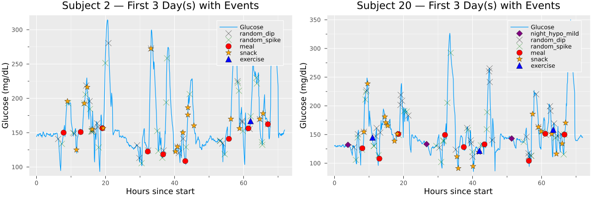

# SimT2D.jl

[](https://everval.github.io/SimT2D.jl/stable/)
[](https://everval.github.io/SimT2D.jl/dev/)
[](https://github.com/everval/SimT2D.jl/actions/workflows/CI.yml?query=branch%3Amain)

SimT2D (Simulate-Type-2-Diabetes) is a Julia-based framework for generating **realistic synthetic continuous glucose monitoring (CGM) data** for individuals with type 2 diabetes (T2D).  
It is designed for research, algorithm validation, and machine learning workflows that require **clinically plausible glucose time series** with event annotations.

## Features

- **Multi-day CGM traces** with 5-minute resolution  
- **Behavioral and physiological event modeling**:  
  - Meals & snacks with realistic postprandial excursions  
  - Exercise-induced glucose dips  
  - Mild & severe nocturnal hypoglycemia  
  - Random spikes and dips (unexplained anomalies)  
- **Circadian delay** modulation of meal responses  
- **Autoregulatory drift** toward baseline and **CGM-like sensor noise**  
- **Event logs** for validation, plotting, and ML training  

**Example: Simulated glucose trace for two subjects with annotated events (first 3 days)**  



## Installation

SimT2D is registered in the Julia General Registry and can be installed via Julia's package manager.

```julia
using Pkg
Pkg.add("SimT2D")
```

## Usage

Once installed, you can use SimT2D to generate synthetic CGM data. Below is a simple example of how to simulate glucose traces for a single subject.

```julia
using SimT2D

subject, event = generate_T2D_data(1)
```

This will generate a DataFrame `subject` containing the CGM glucose values and a DataFrame `event` with the corresponding event annotations. 
More subjects can be simulated by changing the input argument to `generate_T2D_data()`, e.g., `generate_T2D_data(10)` for 10 subjects.

## Author

Tanja Kortsen Bugajski  
Department of Mathematical Sciences, Aalborg University, Denmark  
📧 [tbugaj17@student.aau.dk](mailto:tbugaj17@student.aau.dk)

## Contributors

- **Tanja Kortsen Bugajski** — Creator & primary developer
- **J. Eduardo Vera-Valdés** — Advisor & co-developer

## Roadmap

Planned features and improvements include:
- Enhanced physiological modeling (e.g., insulin dynamics)
- More diverse event types and patterns
- User-defined event scheduling
- Improved documentation and tutorials

## Citation

If you use this code in your work, please cite:

Bugajski T K, Vera-Valdés J. E. SimT2D: A Stochastic Behavioral–Physiological Simulator for Type 2 Diabetes Glucose Traces. 
